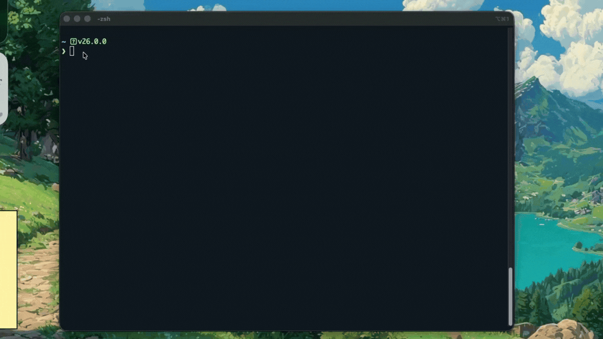
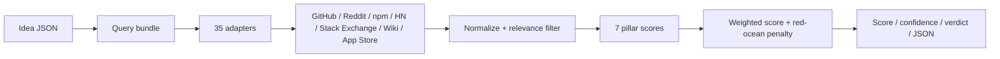

# Impact Compass

<p align="center">
  
</p>

*grab a compass before you sail soldier*

```bash
npm i impact-compass
npx impact-compass idea.json output.json
```

[Documentation](DOCUMENTATION.md) / [Agent Skill Guide](SKILLS.md)

A purely statistical, deterministic startup idea validator and market research CLI for founders, indie hackers, builders, and developer-tool maniacs.

Impact Compass runs product-market fit checks, demand validation, competitive analysis, and market saturation scoring from public evidence. It fetches keyword rankings and engagement signals from real sources like GitHub, npm, Reddit, Stack Exchange, Hacker News, Wikipedia, and the App Store. It checks the *hype* around your project before you waste six months, a billion tokens, and enough coffee to make your keyboard anxious.

No AI. No vibes. No GPT wrapper whispering "*yo this idea is goated*" right before it lies to your face and stabs you in the roadmap.

Impact Compass is a deterministic validation engine. It pulls live, real-world evidence through an API-based keyword scoring pipeline, then runs that data through a brutal scoring engine to tell you if you found a blue ocean or if you are walking into another brilliant project that nobody wants.

Built for:
- founders doing startup validation before writing code
- indie hackers checking if a niche has actual demand
- developers comparing saturated markets before shipping another clone
- AI coding agents that need real market evidence before they start generating files like caffeinated interns

## Watch It Judge

Here is the compass doing its thing: live source scans, terminal drama, ASCII ceremony, and then the score lands. No motivational TED Talk. Just numbers walking in, bad assumptions walking out.

<p align="center">
  
</p>

## The Problem

You have a project idea. You search for it online. You see a few people talking about it, so you assume there is demand and start building for your billionaire dream.

Half a year later, you launch. Nobody cares. Water wasted on those GPUs.

Why? Because you didn't measure the noise. High demand means nothing if the market is already drowning in competitors. You need a way to measure actual pain against market saturation without spending weeks doing manual market research.

## How It Works

Impact Compass takes your idea and compiles a query bundle (problems, solutions, target audiences, and competitors). It then pulls live data from seven pillars of public evidence and runs an advanced logarithmic scoring algorithm. 



It measures:
- **Demand & Pain:** Are people actually complaining about this, or is the problem minor?
- **Momentum & Activity:** Are developers and founders actively building in this space right now?
- **Competition Fit:** If the tool finds 10,000 competitors, your score tanks. Red oceans get penalized heavily.

The score is intentionally simple to read:

1. Score each pillar from 0 to 100.
2. Multiply every pillar by its weight.
3. Add those weighted pillar scores together.
4. Divide by the total weight.
5. Clamp the result between 0 and 100.
6. If demand is above 70 but competition fit is below 30, subtract an extra red-ocean penalty.

Translation: big demand is good, but big demand plus a crushed competition score means you are sailing into a red ocean with a paper boat.

The engine spits out a final score out of 100, along with a brutally honest interpretation of whether you should build it, pivot, or drop the idea entirely.

## Quickstart

Install the published package, then run an evaluation:

```bash
npm i impact-compass
npx impact-compass idea.json output.json
```

### The Input Schema

Give Impact Compass an idea brief and a locked query bundle. The CLI does the digging.

```json
{
  "idea": {
    "name": "A fast global state manager for React",
    "problem": "Redux has too much boilerplate and React context re-renders everything.",
    "targetUser": "React Developers",
    "lens": "Developer Tools"
  },
  "queryBundleForm": {
    "problemKeywords": "react state management, context api re-renders, redux boilerplate",
    "solutionKeywords": "atomic state, react global state library",
    "audienceKeywords": "frontend developer, react dev",
    "competitorKeywords": "zustand, jotai, recoil",
    "exclusions": "vue, angular"
  }
}
```

## Scoring Logic

We stripped out the generic averages. The engine uses logarithmic scaling, so a GitHub repo with 5,000 stars is weighted accurately against one with 5 stars. It applies relevance penalties. If a search result does not contain your target keywords, it loses 60% of its value instantly.

Most importantly, we built in a global saturation penalty. If an idea shows massive demand but identical levels of competition, the engine actively drags the score down. It is mathematically impossible to brute-force a 95+ score without finding a true blue ocean.

## Contributing

Pull requests are welcome. If you want to add a new data adapter, like scraping Twitter or IndieHackers, check out the `extendedAdapters.ts` file. Keep the parsing strict and use real engagement metrics.

## License

MIT License. See [LICENSE](LICENSE) for details.
